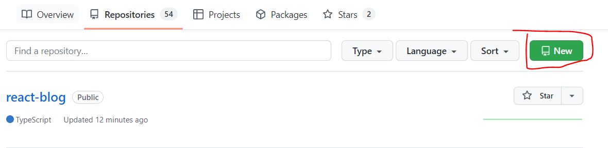
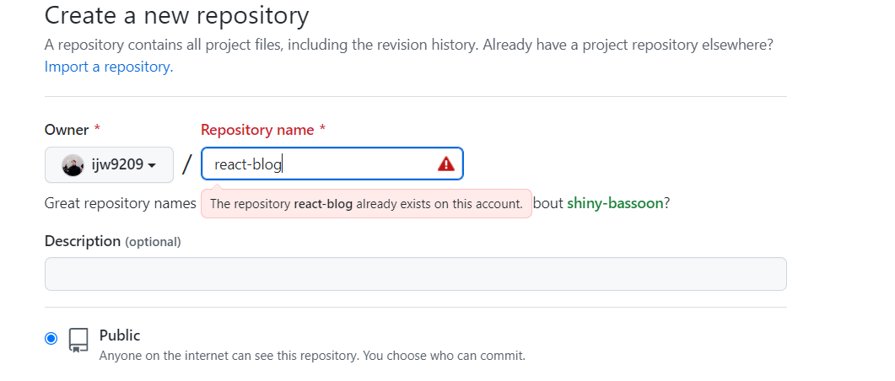

# React & Github Page 만들기

## 1. React 프로젝트 만들기 (CRA)

```

npx create-react-app react-blog --template redux-typescript

```

저는 리덕스와 타입스크립트로 CRA를 만들었습니다.

추가로 redux-toolkit을 install 하였습니다.

```
npm install @reduxjs/toolkit

```

## 2. github 저장소 만들기

새로운 repo 생성

repo 이름은 아무렇게나 해도 된다. 







## 3. 해당 프로젝트에 git 저장소 설치 및 연결

로컬 프로젝트로 와서

```
git init
git add *
git commit -m 'first commit'
git remote add origin https://github.com/ijw9209/react-blog.git
git push -u origin master

```

## 4. github page에 배포

배포하려면 gh-pages 라이브러리 설치 필요

```
npm install gh-pages
```

설치 완료 후 package.json 파일에 hompage 주소 추가

```
"homepage" : https://ijw9209.github.io/react-blog/
```

형식은 http://{userId}.github.io/{repoName}
userId는 깃허브 아이디 repoName은 아까 작성한 저장소 명으로 작성하면 됨 

script 부분에도 아래와 같은 코드 추가

```
"scripts": {
  "predeploy": "npm run build",
  "deploy": "gh-pages -d build"
}
```

저장후 

```
npm run deploy 
```
명령어로 빌드


+ 나와 같은 경우 .gitignore에 build 파일이 제외되어서 주석을 치고 배포를 진행하였음.
git push 이후 해당 주소로 들어가면 배포 완료!